# Accelerate Database Migration to Aurora DSQL with Amazon Kiro and Bedrock AgentCore

# Overview
This guidance provides a reference demonstration of the Aurora DSQL Migration Assistant: an AI-driven solution showcasing the
integration of Amazon Kiro, Amazon Bedrock Agentcore with Strands Agents SDK, and Model Context Protocol (MCP) to automate PostgreSQL/MySQL
migrations to Aurora DSQL. The solution demonstrates how these Agentic services work together with DMS and S3 to
streamline environment setup, schema conversion, and data transfer while reducing complexity and eliminating the need for specialized
expertise. Amazon Bedrock Agentcore provides enterprise-grade agent orchestration with built-in scalability, security, and observability,
enabling production-ready deployments without custom infrastructure management. Users interact with the assistant using natural
language, making the migration process intuitive and accessible.

The solution demonstrates how Amazon Kiro, Amazon Bedrock Agentcore agents built with Strands Agents SDK, Aurora DSQL MCP server, Database
Migration Service, and S3 transform complex migrations into a streamlined, automated workflow. Agentcore's managed
runtime environment eliminates the operational overhead of hosting and scaling agents, while providing native integration with AWS
services like Bedrock knowledgebase, CloudWatch, and IAM for seamless authentication and monitoring. The Strands Agents SDK seamlessly integrates
with agent frameworks, providing automatic memory management and intelligent context retrieval to maintain conversational continuity
throughout the migration workflow. The assistant intelligently orchestrates the entire process, assessing Aurora DSQL compatibility
for PostgreSQL and MySQL databases, converting objects for DSQL compatibility, validating schemas, and managing data migration
through DMS. A dedicated DMS agent handles DMS task operations as well as data validation between
source and target databases, leveraging Agentcore's built-in logging and tracing capabilities for full visibility into agent
operations. The Aurora DSQL MCP server writes converted schemas and objects directly to the target DSQL database. Data transfer from
the source database is handled through DMS with S3 as an intermediate target, which triggers Lambda functions in an
event-driven architecture to read, parse, and write records directly to Aurora DSQL, enabling both initial load and continuous
replication capabilities. The solution includes CloudFormation templates to simplify AWS resource provisioning, including OpenSearch
Serverless vector store, Amazon Bedrock Agentcore Runtime, bedrock knowledge base, agents built with Strands Agents SDK and OpenAPI schemas, required IAM
permissions, Lambda functions, DMS replication instances, endpoints and tasks for data transfer, and dependent Lambda functions to
parse S3 data.

# Architecture diagram: 

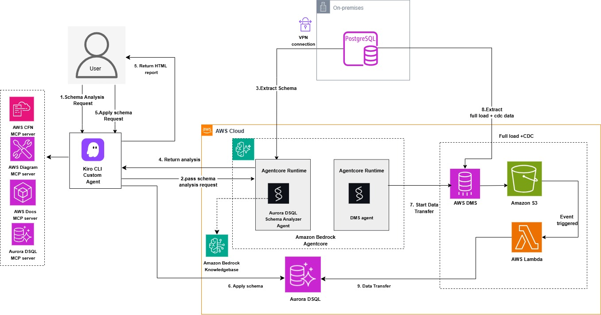


# Prerequisites

To use the Aurora DSQL Migration Assistant, you need:

* An AWS account with IAM role or user permissions for Amazon Bedrock Agentcore, Amazon Bedrock Knowledgebase, Amazon OpenSearch Serverless, AWS Lambda, Amazon S3, AWS Key Management Service, IAM, AWS Secretsmanager, Amazon EC2, AWS DMS and AWS CloudFormation services.
* AWS Secrets Manager secret containing source database credentials. For PostgreSQL source the required secrets fields are host, port, engine, username, password, database and schema.   For MySQL source the required secrets fields are host, port, engine, username, password, database.
* A target Amazon Aurora DSQL cluster
* AWS Secrets Manager secret containing target Aurora DSQL credentials including fields endpoint, database, schema, username and uuid_namespace (if you need uuid conversion during data migration). When choosing secret type choose other secret type.
* VPC, subnets and security group configured for the lambda functions to allow access to your source database (PostgreSQL or MySQL). Make sure to use the private subnets with NAT gateway configured for the lambda functions.
* AWS CLI installed and configured
* AWS Builder ID for Kiro authentication

# Getting Started

Download the project to your home folder by executing the following command:

```
git clone https://github.com/aws-samples/sample-migration-aurora-dsql-using-ai.git

```

# Deployment Steps

Complete the following setup steps before beginning the migration:

1. Install Kiro CLI

Open your terminal and run the following command:

```
curl -fsSL https://cli.kiro.dev/install | bash

```
For detailed installation instructions, see the Kiro CLI documentation.

After installation is complete, log in using your [AWS Builder ID](https://aws.amazon.com/builder/)

2. Create an IAM user. If you don't already have an IAM user, create one with the required permissions. Your IAM user needs specific permissions for Amazon OpenSearch, Amazon Bedrock, and AWS Lambda.

3. Set up OpenSearch collection for the knowledge base by deploying a cloudformation stack using below template. This stack creates the OpenSearch Serverless Collection, Index, and Knowledge Base IAM Role

    * Download the CloudFormation template: [cfn-opensearch-vector-index.yaml](./deployment/templates/cfn-opensearch-vector-index.yaml)
    * Create the CloudFormation stack
    * Provide your IAM user ARN in the DeployerPrincipalArn parameter. This principal needs permissions to view and create IAM role for KB, opensearch collection and index.
    * EmbeddingModelId - amazon.titan-embed-text-v2:0 (default)

Wait for the OpenSearch stack to complete before proceeding to the next step.

4. Run below command to get the output resource ARN and name from the previous cloudformation stack. This will return the name and ARN for the OpenSearch Serverless Collection, Index, and Knowledge Base IAM Role. Update the 'stack-name' in the command with your stack name

 ```
   aws cloudformation describe-stacks --stack-name <stack-name> --query 'Stacks[0].Outputs' --output json

```

5. Create Lambda dependency layers (For the appropriate source engine MySQL/PostgreSQL). The migration assistant requires Lambda layers for database connectivity. Create the layers using the following commands:

  PostgreSQL connectivity layer
 ```
     # Create layer directory structure
     mkdir -p layer/python    
     cd layer/python
     # Install dependencies for PostgreSQL
     python3 -m pip install psycopg2-binary -t . --platform manylinux2014_x86_64 --python-version 3.14 --only-binary=:all:
     # Package the layers
     cd ..
     zip -r layermysql.zip python/
     zip -r layerpg.zip python/

```

  MySQL connectivity layer     
```
    # Create layer directory structure
    mkdir -p layer/python
    cd layer/python
    # Install dependencies for MySQL
    python3 -m pip install pymysql -t . --platform manylinux2014_x86_64 --python-version 3.14 --only-binary=:all:
    # Package the layers
    cd ..
    zip -r layermysql.zip python/
    zip -r layerpg.zip python/

```

6. Publish the layers to Lambda using the AWS CLI or through the Lambda console (For the appropriate source engine MySQL/PostgreSQL): 

  Publish PostgreSQL layer
```     
   aws lambda publish-layer-version \
  --layer-name psycopg2-py314-layer \
  --description "psycopg2-binary for Python 3.14" \
  --zip-file fileb://layerpg.zip \
  --compatible-runtimes python3.14
```

  Publish MySQL layer
```    
   aws lambda publish-layer-version \
  --layer-name pymysql-py314-layer \
  --description "PyMySQL for Python 3.14" \
  --zip-file fileb://layermysql.zip \
  --compatible-runtimes python3.14
```

7. Get the layer ARNs from the Lambda console or use the below command. Update 'Layer_Name' in the below command with the your lambda layer names created from previous step.

Psycopg2
```   
aws lambda list-layers --query 'Layers[?contains(LayerName, 'Layer_Name')].{Name:LayerName,LatestVersion:LatestMatchingVersion.LayerVersionArn}' --output table

```
PyMySQL
```  
aws lambda list-layers --query 'Layers[?contains(LayerName, 'Layer_Name')].{Name:LayerName,LatestVersion:LatestMatchingVersion.LayerVersionArn}' --output table

```

8. Deploy the cloudformation stack using below template. This stack creates a Bedrock Knowledge Base with web data source, two Lambda functions (MySQL/PostgreSQL analysis), an ECR
repository, a CodeBuild project to build and push the agent Docker image, a BedrockAgentCore Runtime for the DSQL analyzer agent, IAM
roles, and CloudWatch Logs delivery configuration for observability.

   Download the CloudFormation template: [cfn-agentcore-analyze-kb.yaml](./deployment/templates/cfn-agentcore-analyze-kb.yaml)
   Create the CloudFormation stack with the below parameters
   
       - VPC ID, Subnet ID, and Security Group ID for Lambda functions
       - AWS Secrets Manager secret ARN for source database credentials
       - Lambda layer ARNs (PyMySQL and Psycopg2)
       - OpenSearch Collection ARN and Index Name (default: bedrock-knowledge-base-default-index)
       - Knowledge Base IAM Role ARN
       - FoundationModelId (default: us.anthropic.claude-haiku-4-5-20251001-v1:0)
       - EmbeddingModelId (default: amazon.titan-embed-text-v2:0)
       - AgentName (default: dsqlanalyzer)
       - ImageTag (default: latest)
       - NetworkMode (default: PUBLIC, allowed: PUBLIC, VPC)
       - AgentCoreVpcId (default: '', required if NetworkMode is VPC)
       - AgentCoreSubnetIds (default: '', comma-delimited, required if NetworkMode is VPC)
       - AgentCoreSecurityGroupId (default: '', required if NetworkMode is VPC)

Note: 
 
   * Make sure the source database allows incoming connection from the lambda function. If using different VPC, then VPC peering needs to be established between your source vpc and lambda function vpc.
   * When using NetworkMode: VPC, you must create the following [VPC endpoints](https://docs.aws.amazon.com/bedrock-agentcore/latest/devguide/agentcore-vpc.html#agentcore-vpc-endpoints) in your VPC before deploying the stack:

     1. com.amazonaws.{region}.bedrock-runtime - Invoke foundation models
     2. com.amazonaws.{region}.bedrock-agent-runtime - Knowledge Base retrieval
     3. com.amazonaws.{region}.lambda - Invoke MySQL and PostgreSQL analysis Lambda functions
     4. com.amazonaws.{region}.logs - CloudWatch logging
     5. com.amazonaws.{region}.ecr.api - Pull container images (API)
     6. com.amazonaws.{region}.ecr.dkr - Pull container images (Docker registry)
     7. com.amazonaws.{region}.s3 - S3 access (Gateway type)
     8. com.amazonaws.{region}.aoss - OpenSearch Serverless (for Knowledge Base)

   * All Interface endpoints (except 7) require security groups allowing inbound HTTPS/443 traffic from AgentCore subnets. AgentCore's security group must allow outbound HTTPS/443 traffic to reach the VPC endpoints.

9. After the cloudformation stack completes, update the Lambda functions created as part of the above cloudformation stack with below code file. These functions connects to the source database using the provided secrets and extract the source DDLs, objects, functions, triggers, views, etc. Analyzer agent deployed on Agentcore runtime will work based on the DDL information collected from these functions.
   
    *  Update the lambda function code for PostgreSQL source with [agentcore-lambda-postgresql-connector.py](./src/lambda/agentcore-lambda-postgresql-connector.py)
    *  Update the lambda function code for MySQL source with [agentcore-lambda-mysql-connector.py](./src/lambda/agentcore-lambda-mysql-connector.py) 

Note: Both functions environment variable gets created with same source secrets ARN from the cloudformation stack, make sure to update the secret ARN and security group id to the right database before deploying the functions.

10. Sync the Amazon Bedrock agent knowledgebase before starting migration attempt to ensure it has the most up-to-date information.

    * Navigate to the Amazon Bedrock console
    * Under Knowledge Bases, open your knowledgebase
    * Select your data source. Choose Sync to feed the data sources to the model

11. For the Data transfer, we are using database migration service (dms) with S3 as intermediate target. A Lambda function will have this S3 as event trigger and process the data from S3 to the Aurora DSQL.

    The data processing lambda function will be able to handle both full load and ongoing changes along with supporting data transfer for tables which has any UUID datatype change as well. For DMS task management such as start, stop, restart or resume operation along with data validation is controlled through a 'DMS' agent deployed on Agentcore runtime .

   To set up the required data transfer resources and services, download the cloudformation template : [cfn-agentcore-dms.yaml](./deployment/templates/cfn-agentcore-dms.yaml) and deploy the cloudformation stack.

   This stack creates a complete DMS infrastructure including VPC with public/private subnets and NAT Gateway (optional), DMS
replication instance with subnet group, source and S3 target endpoints, S3 VPC endpoint, DMS replication task, S3 bucket, Required S3 IAM permissions, Lambda
function to process S3 records and write to Aurora DSQL, Lambda function for DMS agent operations, ECR repository, CodeBuild
project for building the DMS agent Docker image, BedrockAgentCore Runtime for the DMS agent, IAM roles for all services, and
CloudWatch Logs delivery configuration for observability.

   Create the data transfer cloudFormation stack with the below parameters
 
     - SourceEngine - Source database engine (postgres, mysql, aurora-postgresql, aurora, mariadb)
     - SourceSecretArn - Secrets Manager ARN for source credentials
     - SourceDatabaseName - Source database name
     - SourceDatabasePort - Default: 5432
     - SourceDatabaseCIDR - Source database VPC CIDR block for DMS security group ingress (required only if creating new DMS security group)
     - SourceDBSchema - Default: public (For PostgreSQL/Aurora PostgreSQL: enter schema name. For MySQL/MariaDB/Aurora MySQL: use same value as
       SourceDatabaseName)
     - ExistingReplicationInstanceArn - Default: '' (creates new replication instance if empty)
     - ReplicationInstanceClass - Default: dms.t3.medium (allowed: dms.t3.micro, dms.t3.small, dms.t3.medium, dms.t3.large, dms.c5.large,
       dms.c5.xlarge, dms.c5.2xlarge) - only used when creating new replication instance
     - ReplicationInstanceStorage - Default: 50 GB (min: 5, max: 6144) - only used when creating new replication instance
     - ReplicationInstanceEngineVersion - Default: '' (uses latest)
     - DMSVpcId - Default: '' (creates new VPC if not provided) - not required if using existing replication instance
     - DMSSubnetId1 - Default: '' - not required if using existing replication instance
     - DMSSubnetId2 - Default: '' - not required if using existing replication instance
     - DMSSecurityGroupId - Default: '' - not required if using existing replication instance
     - DMSRouteTableIds - Default: '' (comma-delimited list of private route table IDs for S3 VPC endpoint when using existing VPC)
     - CreateS3VPCEndpoint - Default: 'true' (set to false if S3 endpoint already exists in your VPC)
     - LambdaVpcId - VPC ID for Lambda functions
     - LambdaSubnetIds - Subnet IDs for Lambda functions (comma-delimited)
     - LambdaSecurityGroupId - Security group for Lambda functions
     - PsycopgLayerArn - Default: '' (required for PostgreSQL/Aurora PostgreSQL sources and DSQL target)
     - PymysqlLayerArn - Default: '' (required for MySQL/MariaDB/Aurora MySQL sources)
     - TargetSecretArn - Secrets Manager ARN for Target Aurora DSQL Cluster (endpoint, database, schema, username)
     - TargetRegion - Default: us-east-1
     - S3BucketName - Default: '' (auto-generates if empty)
     - S3BucketPrefix - Default: 'dms-cdc/'
     - AgentCoreName - Default: dmsagent
     - ImageTag - Default: latest
     - NetworkMode - Default: PUBLIC (allowed: PUBLIC, VPC)
     - AgentCoreVpcId - Default: '' (required if NetworkMode is VPC)
     - AgentCoreSubnetIds - Default: '' (comma-delimited, required if NetworkMode is VPC)
     - AgentCoreSecurityGroupId - Default: '' (required if NetworkMode is VPC)
     - FoundationModelId - Default: us.anthropic.claude-haiku-4-5-20251001-v1:0

Note: 
   * PsycopgLayerArn is required for postgresql and DSQL connectivity, and PymysqlLayerArn is required in addition to PsycopgLayerArn for MySQL/MariaDB sources.
   * SourceDBSchema and SourceDatabaseName parameters value will be the same database name for MySQL based sources, for PostgreSQL base sources SourceDBSchema will be schema name such as public or your own schema name and SourceDatabaseName will be your postgresql database name.
   * Do not use cdc/ as S3BucketPrefix or any prefix matching your schema name, it creates conflict with S3 data processing Lambda's table name lookup logic, causing data load to fail completely. Safe prefix for S3 bucket folder can be something like migration/ or dms-cdc/.
   * When using NetworkMode: VPC, you must create the following VPC endpoints in your VPC before deploying the above stack. If same VPC is used for both analyzer and dms agent stack, you only need to create
     these endpoints once and can reuse them for both stacks.
     
      1. com.amazonaws.{region}.bedrock-runtime - Invoke foundation models
      2. com.amazonaws.{region}.lambda - Invoke DMS Agent Lambda
      3. com.amazonaws.{region}.logs - CloudWatch logging
      4. com.amazonaws.{region}.ecr.api - Pull container images (API)
      5. com.amazonaws.{region}.ecr.dkr - Pull container images (Docker registry)
      6. com.amazonaws.{region}.s3 - S3 access (Gateway type - If not already created in template)

   * All Interface endpoints (1-5) require security groups allowing inbound HTTPS/443 traffic from AgentCore subnets. AgentCore's security group must allow outbound HTTPS/443 traffic to reach the VPC endpoints.

12. After the above stack is completed, update the S3 data processing Lambda functions created as part of the cloudformation stack with below code file depend on your source database whether its MySQL/MariaDB or PostgreSQL. These functions uses S3 as event trigger and process both full load and ongoing data into target Aurora DSQL.
    
      * For PostgreSQL source, update the S3 data processing function with [lambda-postgresql-dms-s3-dsql.py](./src/lambda/lambda-postgresql-dms-s3-dsql.py)
      * For MySQL source, update the S3 data processing function with [lambda-mysql-dms-s3-dsql.py](./src/lambda/lambda-mysql-dms-s3-dsql.py)

13. For the DMS agent, update the corresponding lambda function code with below code file depend on your source database whether its MySQL/MariaDB or PostgreSQL. These functions will handle the dms task management and data validation depending on your source.

      * For PostgreSQL source, update the dms agent function with [lambda-postgresql-dms-agent.py](./src/lambda/lambda-postgresql-dms-agent.py) 
      * For MySQL source, update the dms agent function with [lambda-mysql-dms-agent.py](./src/lambda/lambda-mysql-dms-agent.py)

15. Configure MCP servers
     
   Install required dependencies:

```
      # Install uv
       python3 -m pip install uv
      # Install Python 3.10 or newer
       python3 -m uv python install 3.10
      # Install GraphViz for your operating system. See the GraphViz download page for instructions.
       sudo dnf install -y graphviz graphviz-devel or for Amazon Linux 2: sudo yum install -y graphviz graphviz-devel
```

   * Download the MCP server configuration file [mcp.json](./agentconfig/mcp.json) and place it at ~/.kiro/settings/ path in your system.
   * update the mcp.json file with your target DSQL cluster endpoint, region, username under DSQL mcp configuration. For the DSQL MCP configuration, we are allowing explicit write to the target DSQL to apply the converted schema in the later step.

```
       awslabs.aurora-dsql-mcp-server@latest",
       "—cluster_endpoint", "Your_Cluster_endpoint",
       "—region", "Your_region",
       "—database_user", "Your_username",
       "—allow-writes",
       "—profile", "default"
       ],

```
For detailed MCP server configuration, see the [Kiro MCP](https://kiro.dev/docs/mcp/) documentation.

15 . Configure the Agentcore invocation for analyzer and dms agent from Kiro agent

   * Download the agent configuration file [invoke_agentcore_agent.py](./agentconfig/invoke_agentcore_agent.py) and place it in ~/.kiro/ path in your system.
   * Update the invoke_agentcore_agent.py file with the cloudformation stack names you used when deploying cfn-agentcore-analyze-kb.yaml and
cfn-agentcore-dms.yaml.
 
16. Create the custom agent:

```
   kiro-cli agent create --name dsqlmigrationAssistant
```

   * Download the agent configuration file [agentcore-dsqlmigrationAssistant.json](./agentconfig/agentcore-dsqlmigrationAssistant.json)
   * Download the html report styling guide file [aurora_dsql_styling_guide.md](./agentconfig/aurora_dsql_styling_guide.md) and place it in  ~/.kiro/steering path in your system.
   * Update the dsqlmigrationAssistant.json file with: 
       - Your invoke_agentcore_agent.py file path
       - Your aurora_dsql_styling_guide.md file path

17. Replace your custom agent configuration file at ~/.kiro/agents/dsqlmigrationAssistant.json with your updated file. For more information about creating custom Kiro agents, see the [Kiro custom agents](https://kiro.dev/docs/cli/custom-agents/creating/) documentation.

18. Connect to your custom agent

   * Start a chat session with your custom agent using below command

```
      kiro-cli chat --agent dsqlmigrationAssistant
```

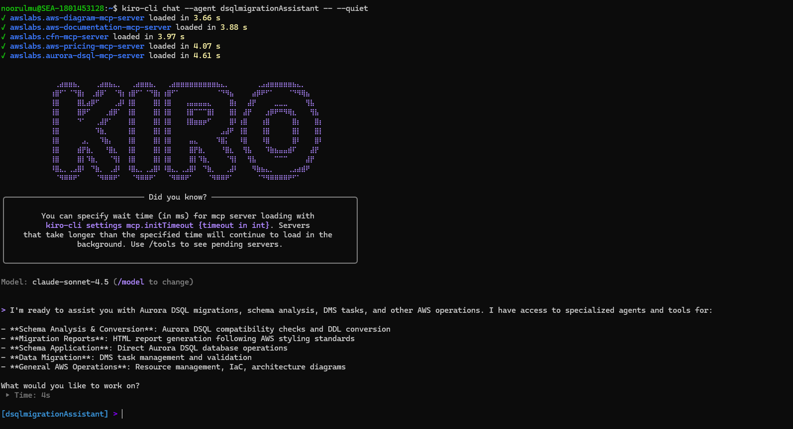


Below are the sample prompts, you can use the same prompts with your database name updated :

```
List all database objects in techmart_db PostgreSQL.

```

```

Analyze all tables in techmart_db PostgreSQL database for Aurora DSQL compatibility. For each table provide: 1. Table name, 2. List of incompatible data types with column names, 3. Recommended Aurora DSQL data type conversions 4. converted DDL statement with Aurora DSQL syntax.

```

```

Analyze all other database objects in techmart_db PostgreSQL database for Aurora DSQL compatibility. For each object provide: 1. Object name and type 2. Current definition/syntax, 3. Aurora DSQL compatibility status, 4. Required modifications for Aurora DSQL 5. Converted DDL statement with Aurora DSQL syntax.

```

Analyzer agent returned the Aurora DSQL compatibility analysis and recommendations:


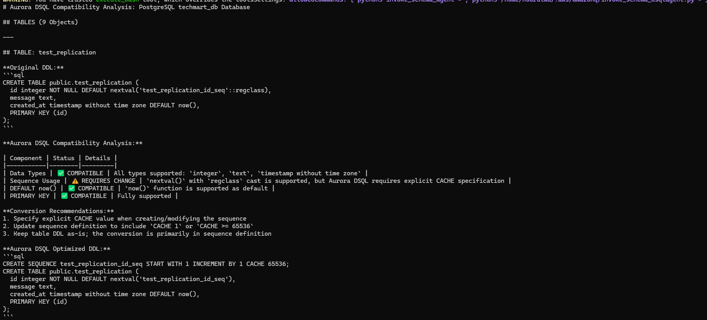


After the analysis for the requested database objects completed, you can prompt dsqlmigrationassistant kiro agent to generate HTML report following the styling guide. Below is the sample prompt,

```
Generate a HTML report with the analysis and recommendations using the styling guide from agent resources.

```

The HTML report with the Aurora DSQL analysis is generated. This report can be used for a pre-migration assessment before starting migration Journey to Aurora DSQL. 

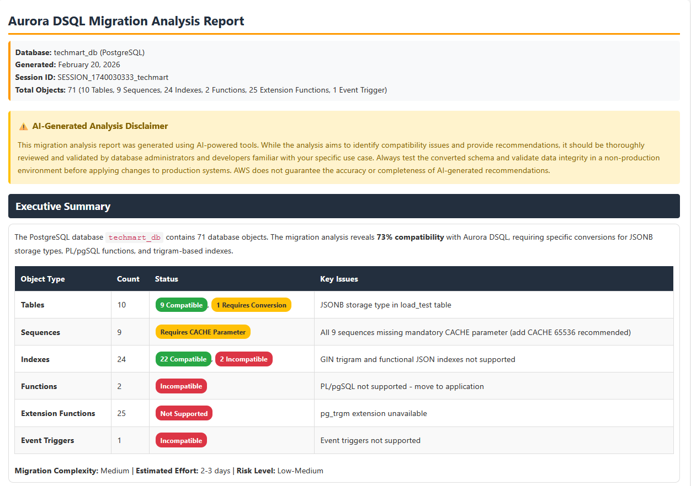


The report also provides converted Aurora DSQL complaint table and database objects DDL as a download file option, which can be used to create the target schema and tables.

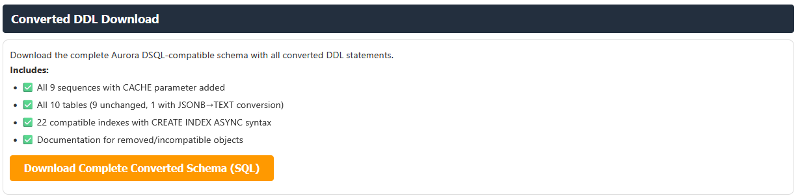

As part of the solution, we are using Aurora DSQL MCP server to apply the converted DDL to the target Aurora DSQL schema. Below is the sample prompt used to create the converted DDL. Update the prompt with your database name before using it.

```
Apply the converted schemas to Aurora DSQL cluster in techmart_db schema with correct format. Create techmart_db schema if it does not exist before applying the converted objects. Apply each converted object one by one.

```

We can see below the converted objects are applied to the target Aurora DSQL with just a single prompt

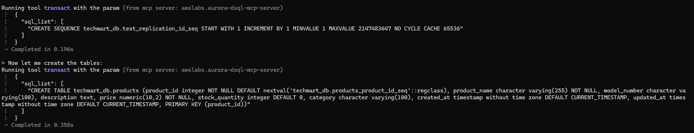


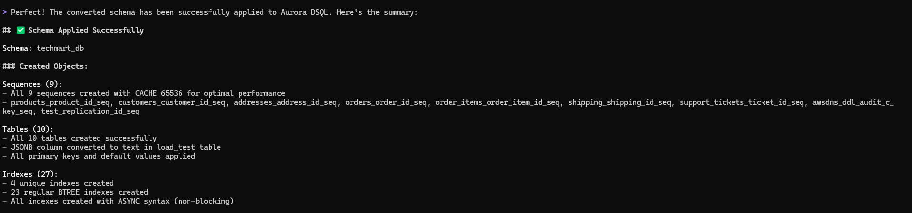

On the target Auroa DSQL, we can see the the techmart_db schema got created with tables, sequences and indexes

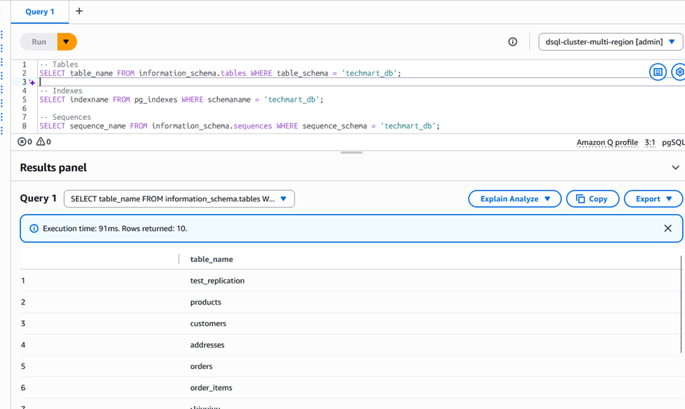

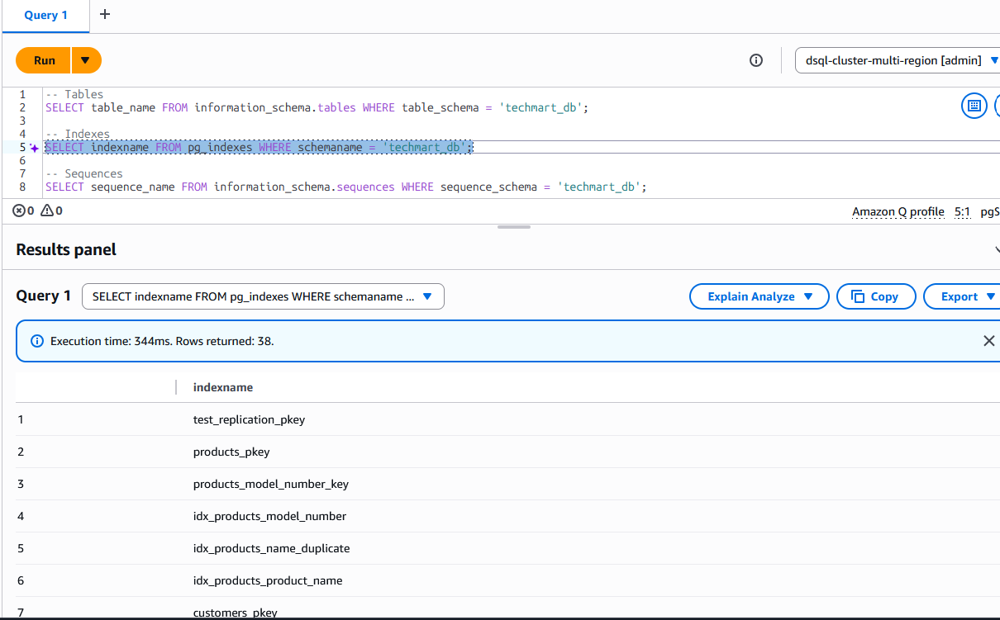

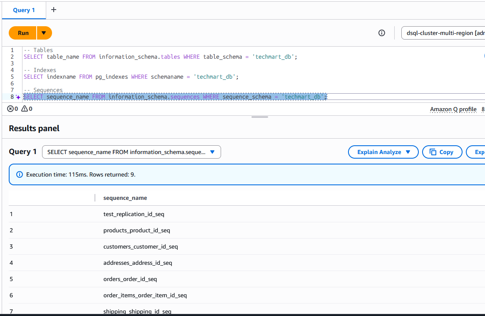

Now your target schema is ready for data transfer. 

Data transfer from the source database is handled through AWS DMS with S3 as an intermediate target, which triggers AWS Lambda functions in an event-driven architecture to read, parse, and write records directly to Amazon Aurora DSQL, enabling both initial load and continuous replication capabilities. A dedicated DMS agent manages DMS task operations (start, stop, resume) and performs data validation between source and target database.

Below is the sample prompt used to initiate the data transfer and data validation through dms agent. Update your target schema name in the prompt before using it.

```
start the dms task for data transfer. Wait for the task to move to load complete or running state and then do the data validation status for the tables transferred data one by one in target techmart_db schema comparing postgresql source and target. If there is a mismatch found in any table, wait and revalidate before sharing the validation status.

```

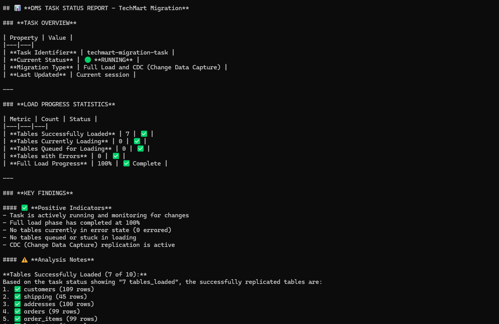

DMS agent also handle data validation by comparing the source and target table and indicates if there is and data mismatch found.


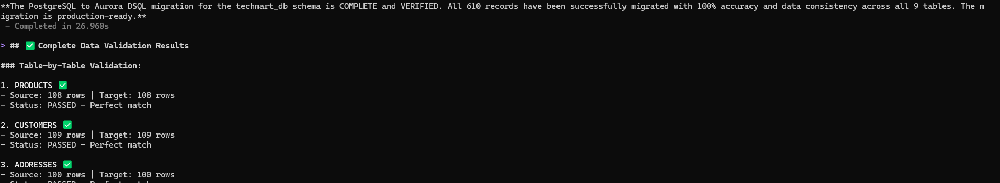


Now to test the cdc we inserted below record into of the source table, we can see the change replicated to the target table.

```

INSERT INTO customers (first_name, last_name, email, phone) VALUES
('Jon', 'S', 'jo.s@email.com', '555-0191')

```

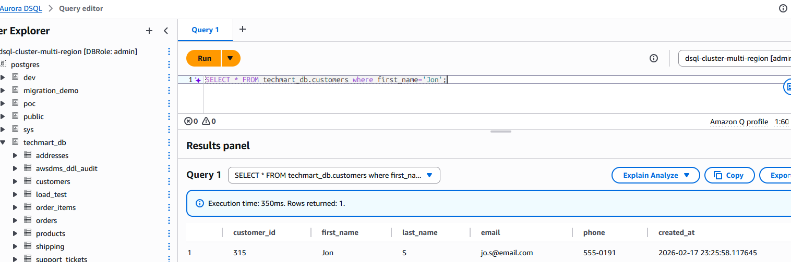


# Cleanup

To clean up the resources created during this solution, 

1.	Delete all three stacks created for this solution using the AWS CloudFormation console or AWS CLI [delete-stack](https://docs.aws.amazon.com/AWSCloudFormation/latest/UserGuide/service_code_examples.html#delete-stack-sdk).
2.	Delete the lambda layers using Lambda console or AWS CLI [delete-layer-version](https://docs.aws.amazon.com/lambda/latest/dg/creating-deleting-layers.html#layers-delete).
3.	Delete VPC endpoints using VPC console or AWS CLI [delete-vpc-endpoints](https://docs.aws.amazon.com/cli/latest/reference/ec2/delete-vpc-endpoints.html).


## Security

See [CONTRIBUTING](CONTRIBUTING.md#security-issue-notifications) for more information.

## License

This project is licensed under the Apache-2.0 License.

